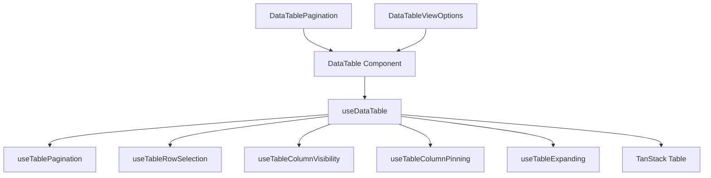
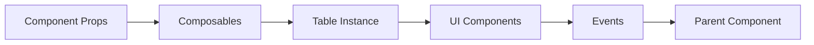
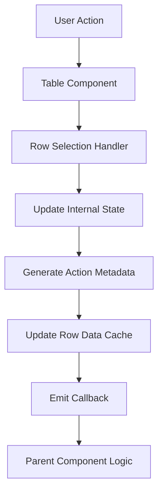

# System Patterns: shadcn-table-vue

## Architecture Overview
The library follows a composable-based architecture, separating core table functionality into individual composables that can be combined in the main `useDataTable` hook.

## Core Design Patterns

### 1. Composition Pattern
The project heavily leverages Vue 3's Composition API with composables:
- Each feature (pagination, row selection, etc.) has its own composable
- The main `useDataTable` composable combines these features
- Components consume the table instance and render accordingly

### 2. State Management
- Reactive state using Vue's `ref` and `computed`
- State persistence via localStorage for user preferences
- Prop-based external control with internal state fallbacks
- Change handlers and watchers for state synchronization

### 3. UI Component Structure
- Core `DataTable` component for table rendering
- Auxiliary components for specific features (pagination, view options, etc.)
- Utility components for loading states and skeletons
- Composition over inheritance for component relationships

### 4. Metadata Feedback Pattern
- Actions provide metadata about their nature (e.g., selection metadata)
- Components bubble up both state and context for parent components
- Rich callback interfaces with multiple parameters for better understanding of actions

## Component Relationships

### Feature Composables
Each feature composable follows a similar pattern:
- Accept configuration options
- Create and manage state
- Provide event handlers and utility methods
- Return state, handlers, and configuration for TanStack Table

### UI Components
- Primary component (`DataTable`) accepts a table instance
- Secondary components accept properties and emit events
- Components use slots for customization points
- Conditional rendering based on state

## State Flow

## Data Flow
For row selection, the data flow is:

